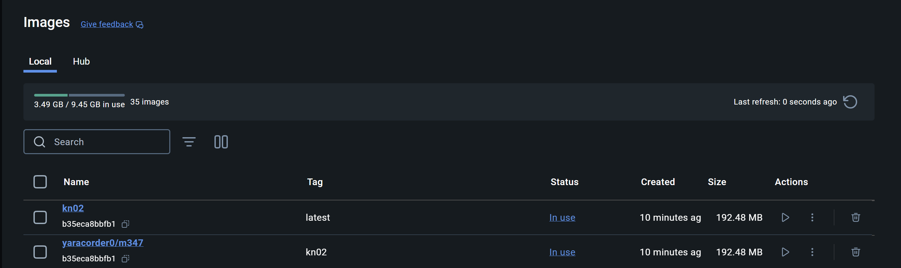
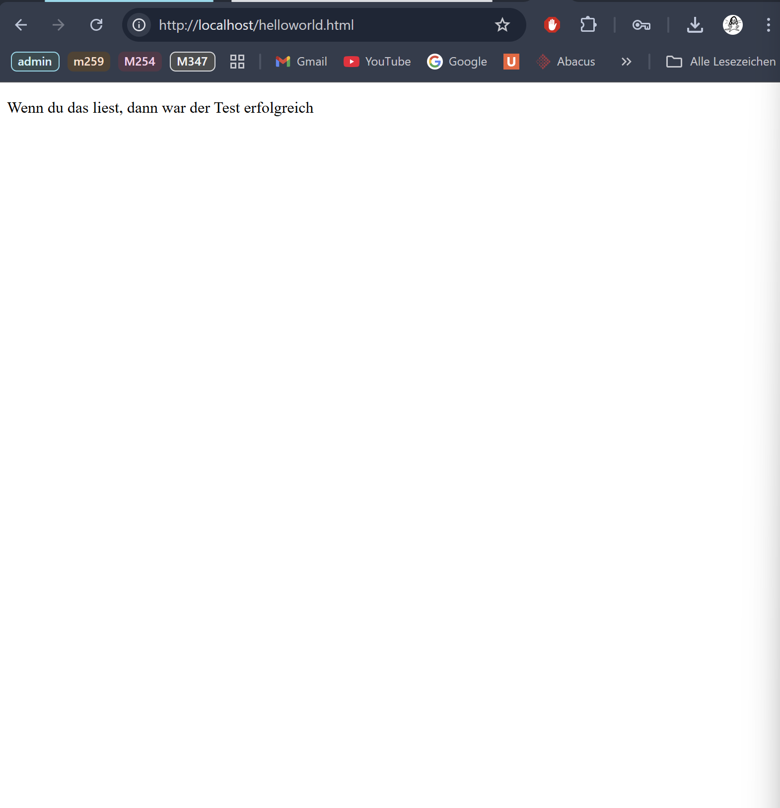
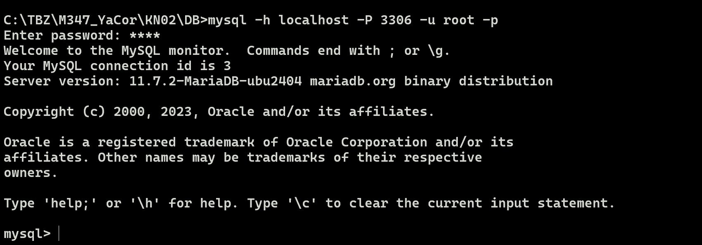
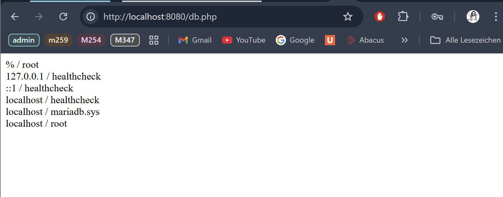
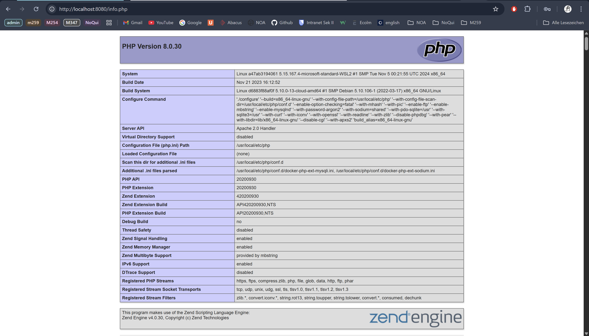

# KN02: Dockerfile

## A) Dockerfile I

``` bash
FROM nginx # Use the official Nginx image as the base.
COPY static-html-directory /var/www/html # Copy your website files into Nginx's web serving directory.
EXPOSE  80 # Declare that the container will listen on port 80 (HTTP).
```

[Dockerfile](A/Dockerfile)



```
docker build --tag kn02 .

docker run -d -p 80:80 kn02

docker tag kn02 yaracorder0/m347:kn02

docker push yaracorder0/m347:kn02
```




-----

## B) Dockerfile II

### [Dockerfile_db](DB/Dockerfile)
````
docker build -t kn02n-db-image .

docker run -d --name kn02b-db -p 3306:3306 kn02b-db-image
````



### [Dockerfile_web](WEB/Dockerfile)
```
docker build -t kn02b-web-image .

docker run -d --name kn02b-web --link kn02b-db:mysql -p 8080:80 kn02b-web-image
```






